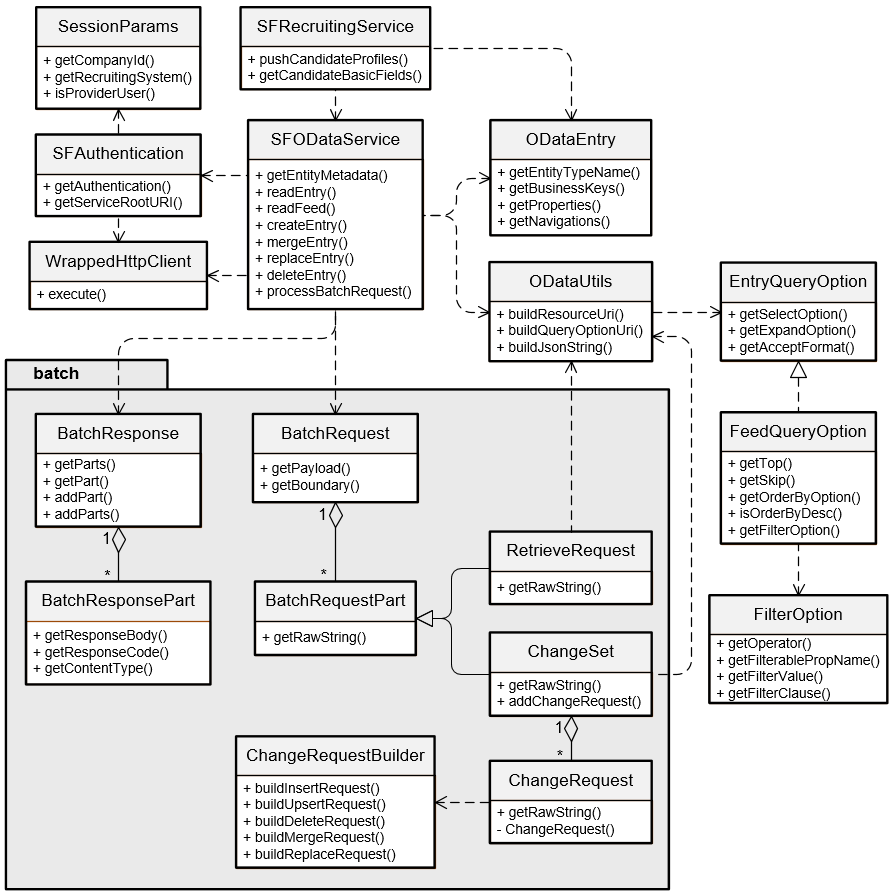

# Octopus OData Service

**Octopus OData Service**, 可以帮助你快速使用OData API与SuccessFactors进行通讯.
本项目使用Spring-Boot作为App框架, 使用Maven管理依赖jar包.

---

## Architecture Design

## 搭建本地开发环境
确保本地已经安装Git和Maven

### 设置本地数据库
- 安装 **MySQL(CE)** (v5.7+)
- 使用 **"root"**作为用户名和密码; 否则请把你的用户名密码更新到 `src/main/resources/application.yml` 中
- 创建数据库schema, 名为 **"octopus"**, 注意必须用UTF-8作为charset

### 运行代码
- 从GitHub Clone代码
- 实现你的SF业务需求. 注意: 调用SFODataService时, 可以参考**SFODataServiceTest.java**中的内容, **$batch**示例在`src/test/resources`中
- 打开 `src/main/resources/application.yml`, 确保 active profile 为 **"dev"**
- 更新 `src/main/resources/dev-destination.properties`, 输入你的SF账号信息
- 打开命令窗, cd到项目根目录
- 运行 `mvn clean package spring-boot:run -DskipTests` 即可运行本程序

### UT & Code Coverage
- 写 unit test请继承 **"AbstractUnitTest"**
- 写integration test请继承**"AbstractIntegrationTest"**
- 写数据库测试请继承**"AbstractDataJpaTest"**

#### 检查代码覆盖率:
- 运行 `mvn clean package` or `mvn clean package jacoco:report`
- 在浏览器中打开 `target/site/jacoco/index.html`